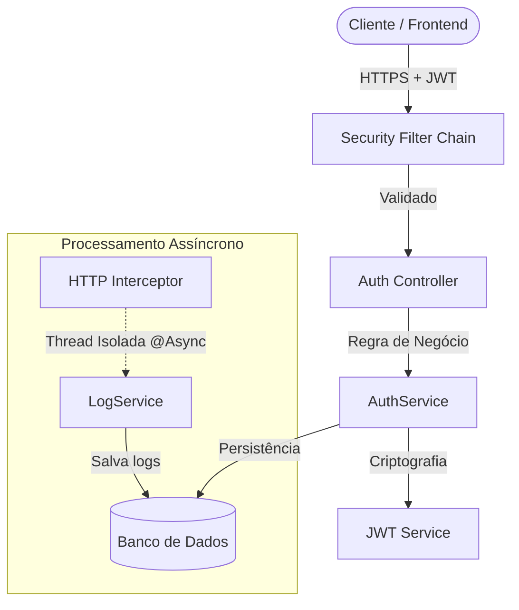
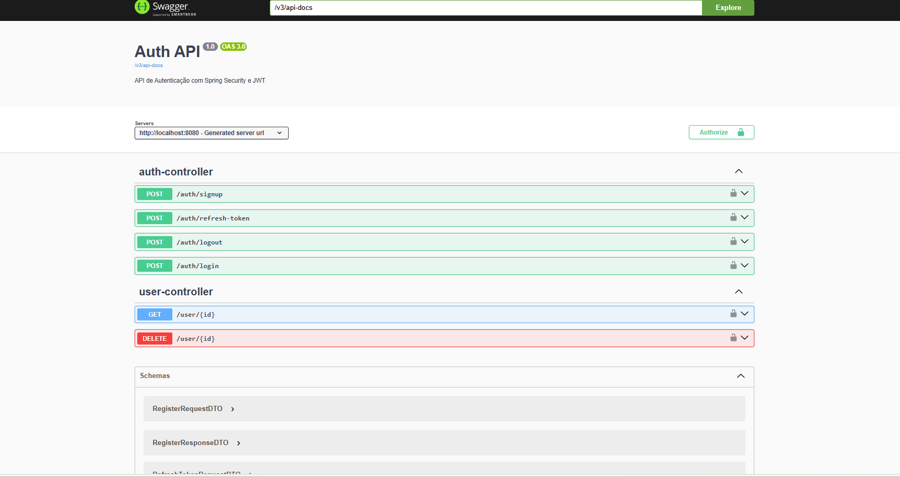

# Sprinf Auth API (Spring Boot 3 + Security 6)


> **Uma arquitetura de autenticação robusta, stateless e escalável pronta para produção.**

## 🎯 Sobre o Projeto

Este projeto foi desenvolvido para resolver o desafio de criar um sistema de autenticação seguro e performático, fugindo das implementações básicas de tutoriais. O objetivo foi arquitetar uma solução **Stateless** (sem sessão no servidor) que mitigasse riscos de roubo de credenciais mantendo uma boa experiência de usuário (UX).

A solução implementa o padrão de **Dual Tokens** (Access Token de curta duração + Refresh Token de longa duração com rotação), além de registro de logs completa via processamento assíncrono.

---

## 🏗️ Arquitetura e Design Patterns

O sistema segue a arquitetura em camadas (Layered Architecture) e utiliza conceitos avançados de engenharia de software:



### 💡 Decisões Técnicas Importantes
- **Segurança (JWT + Refresh Token)**: Implementei Access Tokens com validade de apenas 15 minutos para minimizar danos em caso de vazamento. O Refresh Token (armazenado no banco) permite renovar o acesso sem logar novamente, e pode ser revogado remotamente (Logout Real).

- **Performance (Async Logs)**: Para garantir auditoria sem latência, utilizei interceptadores (HandlerInterceptor) combinados com a anotação @Async. O log de acesso é salvo em uma thread paralela, não bloqueando a resposta ao usuário.

- **Controle de Acesso (RBAC)**: Sistema flexível de permissões N:N onde um usuário pode ter múltiplos papéis (ADMIN, USER), gerenciado via JPA e validação no Spring Security.

- **Boas Práticas**: Uso de Records (Java 14+) para DTOs imutáveis, tratamento global de exceções e injeção de dependência via construtor.

## 🛠️ Tech Stack
- **Linguagem**: Java 17+ (Uso de Records, Streams API, Var, Optional)

- **Framework**: Spring Boot 3

- **Segurança**: Spring Security 6 (Stateless, BCrypt, CORS, CSRF disabled)

- **Banco de Dados**: H2 (Dev) 

- **ORM**: Spring Data JPA + Hibernate (com otimização EAGER fetching para roles)

- **Documentação**: OpenAPI 3 (Swagger UI)

- **Ferramentas**: Maven, Lombok, Git.

## 🔌 Endpoints e Documentação

A API é totalmente documentada via **Swagger UI**. 



| Método | Endpoint | Descrição | Nível de Acesso |
| :--- | :--- | :--- | :--- |
| **POST** | `/auth/login` | Autentica e retorna Access + Refresh Token | Público |
| **POST** | `/auth/refresh-token` | Gera novo JWT usando o Refresh Token | Público |
| **POST** | `/auth/logout` | Revoga o Refresh Token no banco | Autenticado |
| **POST** | `/auth/signup` | Cria novo usuário | Público |
| **DELETE** | `/users/{id}` | Exclui usuários do sistema | ADMIN |
| **GET** | `/users/{id}` | Acessar informações do usuário do sistema | Autenticado |

## Como Rodar Localmente
**Pré-requisitos:** Java 17+ e Maven.

1. **Clone o repositório**:


``` code
git clone https://github.com/VicthorCM/[NOME-DO-REPO].git
cd [NOME-DO-REPO]
``` 

2. **Configure as variáveis (Opcional)**: No arquivo 
```
src/main/resources/application.properties
```

você pode alterar a duração do token ou a chave secreta.


3. **Execute o projeto**:


```bash
mvn spring-boot:run
```

1. **Teste (Credenciais Padrão)**: O sistema inicia com dois usuários pré-criados para facilitar testes:

    - **Admin**: admin@email.com / admin123

    - **User**: usuario@email.com / user123
  
## Estrutura de Pastas

```plaintext
src/main/java/com/github/victhorcm/auth
├── config          # Configurações
(Security, Swagger, WebMVC,Filtros, Interceptadores)
├── controller      # Camada REST (Entrada de dados)
├── dto             # Objetos de Transferência (Records imutáveis)
├── model           # Entidades do Domínio (JPA)
├── repository      # Acesso a Dados
└── services        # Regras de Negócio Core
```

## 👨‍💻 Autor
Feito por ***Victhor C. Magalhães***. Focado em desenvolvimento Backend com Java e Spring Ecosystem.
